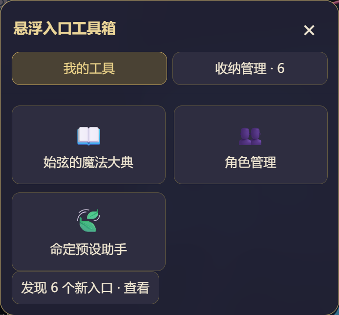

# 悬浮入口工具箱

把 SillyTavern 插件、酒馆助手全局／角色卡／预设脚本产生的悬浮球和悬浮按钮，收进一个可拖动的工具箱。原生 JavaScript + CSS，无运行依赖，无编译步骤，不需要服务器插件。



## 使用

1. 点击屏幕边缘的「工具箱」，进入「收纳管理」。
2. 在自动发现的候选中点击「收纳…」，填写名称和图标，确认后才隐藏原入口。
3. 没发现的入口，点「点选添加」，再点原悬浮球。选取过程不会执行该按钮的功能；Esc 可取消。
4. 「我的工具」按两列显示图标和名称。点击工具会执行原按钮的点击行为，默认自动收起工具箱。
5. 可编辑名称／图标、上下排序、选择「留在外面」或移除规则。「恢复全部原入口」暂停收纳，保留规则以便再次启用。

正常新增脚本、插件或预设只需通过界面确认或点选，不必修改源码。角色／预设切换后，当前不存在的入口等待重新出现；歧义匹配时保留原入口。酒馆扩展设置内也提供收纳管理和恢复入口。

## 安装

将本目录下的 `manifest.json`、`index.js`、`toolbox.js`、`dom.js`、`style.css` 放在酒馆的一个第三方扩展目录内，例如：

```text
public/scripts/extensions/third-party/SillyTavern-Floating-Toolbox/
```

也可以安装在用户扩展目录 `data/<user-handle>/extensions/SillyTavern-Floating-Toolbox/`。刷新浏览器，扩展管理中应出现「悬浮入口工具箱」。关闭扩展的生命周期钩子会清理收纳状态；旧版酒馆关闭扩展后刷新页面即可恢复入口。

当前项目创建在独立 Git 仓库内。未设置远程仓库；如之后将仓库发布到 Git 服务，可通过酒馆的「安装扩展」输入其仓库地址安装。测试文件、文档不是运行时必需文件。

## 规则和识别

- 自动发现依据可点击特征、小尺寸浮动布局等，列出候选，默认不自动收纳新目标。
- 酒馆助手登记的按钮，通过 `TavernHelper.getAllEnabledScriptButtons()` 查询；用脚本 ID 和按钮事件 ID 区分，触发酒馆同一个 `eventSource`。
- 自绘入口使用唯一 ID、属性、类、容器和必要的文字匹配；不生成容易错位的 `nth-child` 规则。
- 点选规则支持可访问的同源 iframe 和开放 Shadow DOM；框架路径也必须唯一。
- 原按钮不移动、不克隆、不删除；通过工具箱专属属性和样式隐藏其视觉与点击区域，触发前恢复原按钮，随后重新匹配。保留尺寸，减少脚本自动调整 iframe 高度引起的抖动。
- 原按钮自身变成大面板或进入对话框时，暂时不隐藏它，避免功能面板一起消失。
- 已收纳入口即使被原脚本留在窄屏视口外，仍可通过工具箱使用；实际停用或隐藏的入口会等待重新出现。
- 所有名称以纯文本渲染，不将第三方 HTML 注入工具箱。
- 收纳规则保存到当前酒馆用户的 `extensionSettings.floating_entry_toolbox`；入口位置保存在当前浏览器，宽屏／窄屏分别记忆。支持 JSON 导入／导出规则。
- DOM 变化合并处理，跳过聊天消息中的逐字更新；每 3 秒补查入口可用性、脚本接口和 iframe 导航。浮动容器查询复用缓存，相关变化时重建；每 30 秒补查没有 DOM 变化的样式更新。

## 边界

不能保证任意自定义入口自动识别。跨域／不透明 iframe、封闭 Shadow DOM、要求真实用户触摸事件的控件，可能无法通用触发。程序异常时恢复该原入口；如果按钮内部静默拒绝代点，可选择「留在外面」。这类对象可能需要专门兼容。纯装饰、完整弹窗、确认框、后台脚本不作为悬浮入口收纳。

规则依赖目标入口提供可持续识别的特征。更新后结构或标识变化，可重新点选；匹配不唯一时不隐藏。没有稳定标识的控件，支持在「编辑 → 高级」中调整 CSS 选择器及匹配文字，仍无需改源码。

## 验证

```bash
npm run check
node tests/server.mjs
```

浏览器打开 `http://127.0.0.1:8766`。独立验证页包含原事件触发、自动发现、按钮重建、歧义恢复、脚本停用／同名按钮、同源框架、Shadow DOM、点选拦截、面板保留、危险容器拒绝、恢复和设置重新加载。它不访问聊天或模型。

实际部署和验证记录见 `docs/验证记录.md`。本项目不包含用户脚本源码、聊天、认证信息或模型密钥。
